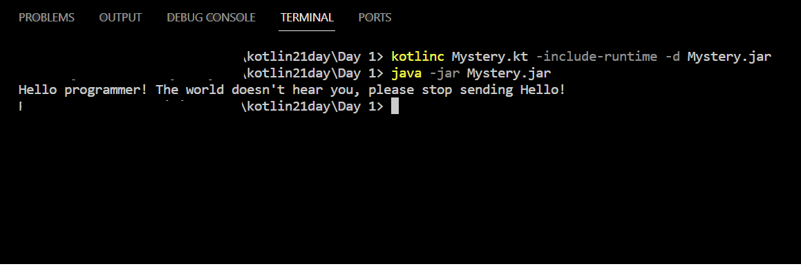

> Kotlin kodu necə olur ki mənim kompyuterimdə/telefonumda nəsə bir iş görür? Bəs mən sadə bir Kotlin kodunu kompyuterimdə necə işə sala bilərəm?

Ümumi proqramlaşdırma biliyimizə əsaslanıb  səthi şəkildə deyə bilərik ki,  mənbə kodu *kompyuterin anlayacağı bir formatda əmrlərə* çevrilməli, əldə edilən bu əmrlər də bir platforma (runtime environment)  üzərində işləməlidir.

Keçən yazımızda görmüşdük ki Kotlin üçün əsas bu tipdə iki platforma var:
- Android(ART) - Kotlin kodunu Androiddə işə salmaq üçün ya Android cihaza, ya da onu imitasiya(təqlid) edən bir proqrama - emulyatora ehtiyac var. İDE istifadə etmirik deyə build prosesi də çox zəhmətli olar deyə bu yoldan getmirik.
- JVM mühiti(JRE) - JVM mühitində Kotlin kodu işə salmaq  nisbətən sadədir. Bizə Kotlin kodunu JVM-in anlayacağı dilə, bytecodelara çevirəcək bir compiler, və o bytecodeları icra edəcək Java Runtime Environment lazımdır.

Bunları necə təmin edə bilərik:
Əvvəlcə [burdan](https://www.oracle.com/java/technologies/downloads/) JDK yükləyib kompyuterimizə qurub, system patha əlavə etməliyik. Bu bizə lazım olan runtime environmenti də ehtiva edən bir proqramdır.
Daha sonra [burdan](https://kotlinlang.org/docs/command-line.html#manual-install)  əməliyyat sistemimizə uyğun şəkildə kotlin compilerı yükləyib, onu da system path-a əlavə etməliyik. 

Bunları necə edəcəyinizi bilmirsinizsə [bu və bunun kimi videoları](https://www.youtube.com/watch?v=JjWTTvWPyH0) izləyin. System patha əlavə etməyimizin səbəbi, compilerı və onu run etmək üçün lazım olan digər əmrləri file sistemin istənilən nöqtəsindən rahat çağırmaqdır.

Tətbiqə keçməzdən əvvəl nə edəcəyimizi nəzəri olaraq bir daha gözdən keçirək.
1. Kompilyator bütün proqramımızı qiymətləndirir və heç bir səhvin olmamasına əmin olur. 
2. JVM Kotlin kimi proqramlaşdırma dillərini başa düşmür. Bu səbəbdən kompilyator mənbə kodumuzu .class faylları şəklində Java bayt koduna çevirir. Bu fayllar daha sonra JVM-ə ötürülür.
3. JVM  bu təlimatları onlara verilən ardıcıllıqla yerinə yetirir. JVM yekun təlimatı tamamladıqdan sonra o, fəaliyyətini dayandırır, yəni proqramımız tam yerinə yetirilmiş olur.

İndi isə bu prosesi reallaşdıraq.
1. Kodumuzu özündə saxlayan qovluğa gəlib, orda CMD(terminal) başladırıq
2. `kotlinc Mystery.kt -include-runtime -d Mystery.jar` əmrini veririk.
- kotlinc kompilyatoru təmsil edir.
- Mystery.kt mənbə kodumuzu təmsil edir.
-  jar uzantısı  sıxışdırılmış çoxlu Java fayllarını təmsil edir(ZIP kimi düşünə bilərik) . include-runtime seçimi jar faylına  Kotlin runtime kitabxanasını daxil edir, yəni müstəqil olaraq run edilə bilər hala gətirir.
3. `java -jar Mystery.jar` əmrini veririk və proqram işə düşür

