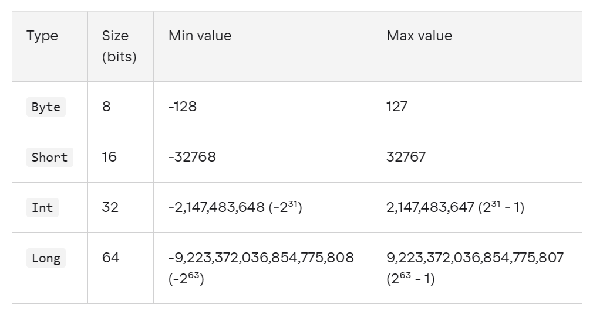

# Gün 2 : Özünü Kotlində ifadə et! (Dəyişənlər və data tiplər)!

Salam dostum! Dünən aldığımız travmadan sonra bir az toparlanıb yenidən klaviatura başına keçdim, və bu boş yerə dəyil. Çünki uzun-uzun düşündükdən sonra niyə Dünyanın məndən xəbəri olmadığını anladım. Axı mən kompyuterə heç vaxt kim olduğumu açıqca deməmişəm! O mənim haqda heç nə bilmir, nə ad, nə yaş, nə ünvan... bu halda necə məktubumu Dünyaya çatdırsın? Axı o anketi doldurmaq lazımdır! 


Bəli məncə bu dəfə də günün problemini təxmin etdiniz:

```
Ən bəsit yanaşma ilə, özüm haqda dataları Kotlində necə ifadə edə bilərəm?
```

Başlayaq ilk sualdan, Kotlində mənim məlumatlarıma qarşılıq nələr var?

[Dokumentasiya](https://kotlinlang.org/docs/basic-types.html) deyir ki Kotlindəki baza data tiplər bunlardır:
- [Ədədlər](https://kotlinlang.org/docs/numbers.html): Rəqəmsal dəyərləri təmsil edir və Int, Double, Float vs  kimi alt tipləri var. (Yaşım üçün ideal görünür)
- [Bulean](https://kotlinlang.org/docs/booleans.html): Məntiqi dəyərləri(true/false) təmsil edir. (Proqramçı olub olmadığımı bunla çatdıra bilərəm)
- [Simvol](https://kotlinlang.org/docs/characters.html): Vahid, tək bir Unicode simvolunu təmsil edir. 
- [Mətn](https://kotlinlang.org/docs/strings.html) -  Simvolların ardıcıllığını təmsil edir.(Adım yüz faiz budur!)
- [Massiv](https://kotlinlang.org/docs/arrays.html) - Eyni tipli birdən çox dəyərin saxlanmasına imkan verir. (Bildiyim proqramlaşdırma dillərinin siyahısını ən yaxşı belə ifadə edərəm)

Ümumi baxdıqda, hər şey gözləniləndir, proqramlaşdırmaki standart data tipləridir. Hər biri haqda daha detallı danışacağıq.

Okay, özümüz haqda məlumatları ifadə etmək üçün hər şeyə sahibik.

Digər araşdırmalı olduğumuz şey, Kotlində dəyişənin necə elan olunduğudur. İstənilən proqramlaşdırma dilində bunun üçün açar sözlər var. 
Kotlində bunlar *var* və *val*-dır
1) Read-only  dəyişənlər val açar sözündən istifadə etməklə müəyyən edilir. Onlara yalnız bir dəfə dəyər təyin edilə bilər, sonradan dəyər mənimsətmək error-a səbəb olacaq.
```
val x = 5
a =6 // error
```
2) var - dəyəri sonradan dəyişdirilə bilər
```
var y = 10
y = 11 // Heç bir problem yoxdur
```
Yaxşı bəs tövsiyə olunan yol hansıdır?
Yenə dokumentasiyaya müraciət edək:
```
Bütün dəyişənləri yalnız read-only (val) elan etməyi tövsiyə edirik. Dəyişənləri (var) yalnız zəruri hallarda elan edin.
```

Bu tövsiyənin səbəblərinin kökləri funksional proqramlaşdırmaya, thread-safety-ə, paralel proqramlaşdırmaya uzanır. Mutability/Immutabilty adlanan bu mövzu haqda növbəti yazılarda  araşdıracağıq.

İndi isə dokumentasiyanı izləyib,  defolt olaraq val açar sözündən istifadə edəcəyik. 

Tam bu  nöqtədə ağlınıza bir sual da gələ bilər : İlk yazımızda Kotlin statik tipli dildir, yəni compiler dəyişənlərin tipini əvvəldən bilmək istəyir demişdik. Axı biz yuxarıdakı kodlarda buna işarə edən heç nə yazmadıq? 

Baxmayaraq ki özümüz tipi açıqca bildirməkdə sərbəstik, Kotlin compilerı dəyişənin tipini özü müəyyənləşdirə bilir, bu xüsusiyyət type inference adlanır. Axı demişdik ki Kotlin bildiyimiz statik dillərdən deyil :). Əslində bu xüsusiyyət Java və C#-da da var, Kotlində bu üstünlük daha qabarıq və populyardır.

Amma biz tiplərlə daha yaxşı tanış olaq deyə tipləri özümüz açıqca bildirəcəyik.


Artıq bütün daşlar oturdusa, keçək problemin həllinə

1) Ad
Ad mətn tiplidir, mətn tipli dəyişənləri isə String adlı tiplə ifadə edirik.
`val name : String = "Teymur"``
String tipi UTF-16 kodlaşdırmasından istifadə edir, bu səbəbdən hər simvol 2 bayt yer tutur, o halda mənim adım 16 bayt yer tutacaq yaddaşda
2) Yaş
Yaşım ədəddir, daha dəqiq tam ədəddir.
Kotlindəki tam ədədlər aşağıdakı kimidir

Hmm, baxdıqda yaşımı ifadə etmək üçün Byte tipi bəs edər kimi görünür
`val age:Byte = 19`
Yaşım da 1 bayt yer tutacaq yaddaşda

3) Proqramçı olub-olmadığım
Düşünürəm ki dünya bu məlumata sahib olsa, daha tez cavab verər
`val amIProgrammer:Boolean = true`
Boolean tipi 1 bayt yer tutur

4) Bildiyim proqramlaşdırma dillərinin siyahısı
Proqramlaşdırma dilinin adı String tipi ilə ifadə edilir, bunu anladıq

val language1:String = "Javascript"
val language2:String = "C#"

Amma bunları bir siyahı kimi göstərsəm daha yaxşı olar

`val languages:Array<String> = arrayOf(language1,language2)`
```
fun main(){
   val name:String = "Teymur"
   val age:Byte = 19
   val amIProgrammer:Boolean = true
    val language1:String = "Javascript"
val language2:String = "C#"
    val languages:Array<String> = arrayOf(language1,language2)
languages.forEach({it->println(it)})
println(name)
println(age)
println(amIProgrammer)
println(languages)
}
```


