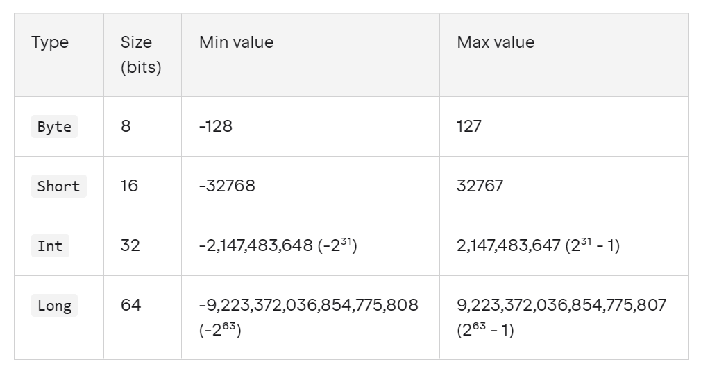
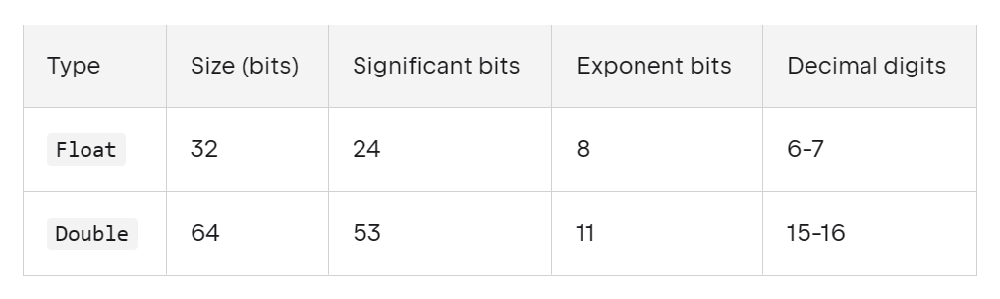

# Gün 2 : Özünü Kotlində ifadə et! (Dəyişənlər və data tiplər)!

## Günün problemi:

### ```Ən bəsit yanaşma ilə, özüm haqda məlumatları Kotlində necə ifadə edə bilərəm?```

Özüm haqda məlumatları qısaca gözdən keçirsəm: 
- Ad
- Yaş
- Proqramçı olub-olmadığım
- Bildiyim proqramlaşdırma dilləri
- Ünvanım(Coğrafi mövqe)

Bu problemi həll etmək üçün silsiləvi şəkilə araşdırıb, cavab tapmalı olduğumuz suallar var:
- Kotlində hansı məlumat növləri var?
- Kotlində dəyişən necə elan olunur? Bir neçə yol varsa hansına üstünlük veririk?
- Kotlində data tiplə mənimsənənə dəyər uzlaşması(type-safety) necə təmin olunur?

### Sual 1: Kotlində mənim məlumatlarıma qarşılıq gələ biləcək nələr var?

[Kotlindəki](https://kotlinlang.org/docs/basic-types.html) baza məlumat növləri bunlardır:
- [Numbers(Ədədlər)](https://kotlinlang.org/docs/numbers.html)
- [Boolean(Məntiqi)](https://kotlinlang.org/docs/booleans.html)
- [Character(Simvol)](https://kotlinlang.org/docs/characters.html)
- [String(Mətn)](https://kotlinlang.org/docs/strings.html)
- [Array(Ardıcıllıqlar)](https://kotlinlang.org/docs/arrays.html)

Belə görünür ki, özümüz haqda məlumatları ifadə etmək üçün hər şeyə sahibik.

### Sual 2 : Kotlində dəyişən necə elan olunur?

Kotlində dəyişən elan etmək üçün *var* və *val* açar sözləri var.
1) **var** - başlanğıcda mənimsədilən dəyərləri yeniləməkdə(reassign) sərbəst olduğumuz dəyişənləri təmsil edir (mutable variables)
```
var x = 10
x = 11 // Heç bir problem yoxdur
```

2) **val** - bir dəfə dəyər mənimsətdikdən sonra onu dəyişməyə icazə verilməyən dəyişənləri təmsil edir(read-only/immutable variables)
```
val y = 5
y = 6 // Kompilyator error göstərəcək
```

### Sual 3: Hansını istifadə etmək məsləhətdir?
Dokumentasiyada yazılır:
> Bütün dəyişənləri read-only (val) elan etməyi tövsiyə edirik. Yalnız zəruri hallarda (var) istifadə edin.

### Sual 4: Kotlində data tiplə mənimsənənə dəyər uzlaşması(type-safety) necə təmin olunur?

> İlk yazımızda Kotlin statik tipli dildir, yəni compiler dəyişənlərin tipini proqram işə düşməmişdən əvvəldən bilmək istəyir demişdik. Axı biz yuxarıdakı kodlarda tip göstərən heç nə yazmadıq? Əvvəlcə ədəd tipi verdiyim dəyişənə sonradan mətn tipli dəyər vermə riski necə önlənir?

Kotlin, Type Inference-ı dəstəkləyən static tipli bir dildir. Yəni, Kotlin compilerı dəyişənin data tipini avtomatik müəyyən edə bilər, əgər dəyişənə dəyər vermisinizsə.

**Amma biz  bu yazıda tipləri özümüz açıqca bildirəcəyik ki, mövzunu daha yaxşı anlayaq**

Artıq bütün daşlar oturdusa, keçək problemin həllinə.

### Ad
Ad mətn tiplidir, onda getdik String tipini araşdırmağa.

> Kotlindəki mətinlər String  ilə təmsil olunur. Ümumiyyətlə, mətn dəyəri qoşa dırnaq içərisində olan simvollar ardıcıllığıdır ("). 

`val name : String = "Teymur"` 

## Yaş
Yaşım ədəd tiplidir, onda getdik Number tipini araşdırmağa
Number tipi də öz içində iki alt-növə ayrılır : Integer(Tam) və Floating-Point(Həqiqi) ədədlər
Yaşım tam ədəddir, bu səbəbdən tam ədədlərə fokuslanaq



Gördüyümüz kimi müxtəlif məqsədlər üçün müxtəlif tam ədəd tipləri var. Ən çox istifadə olunan Int-dir.
Amma yaşımı ifadə etmək üçün Byte tipi bəs edər.
`val age:Byte = 19`

## Proqramçı olmağım
Bu məlumatı "Mən proqramçıyam" mülahizəsinin məntiqi dəyəri kimi təsvir edə bilərik.
> İki dəyərə(true/false) malik ola bilən məntiqi dəyərlər Boolean tipi ilə təmsil olunur

`val IamProgrammer:Boolean = true`

## Bildiyim proqramlaşdırma dillərinin siyahısı
Hər bildiyim dilin adını Stringlə ifadə edəcəm, bu artıq aydındır.

```
val language1:String = "Javascript"
val language2:String = "C#"
```

Amma bunlar bir yerdə və ardıcıl düzüldükdə məna daşıyırlar. Bu halda Array tipini araşdıraq.

> Array eyni tipdə və sabit sayda dəyərləri saxlayan məlumat strukturudur. 

Kotlin-də array yaratmaq ən sadə halda **arrayOf()**  funksiyasından istifadə edirik.
Arrayin hansı tipdə dəyərlər daşıyacağını da açıqca yazırıq.
`val languages:Array<String> = arrayOf(language1,language2)`

## Coğrafi mövqeyim
paralel: 40.14
meridian : 47.57 

Okay bu dəyərlər kəsr ədədlərdir, onda Floating-Point növünü araşdıraq



Bir çox hallarda Double-a üstünlük verilir biz də Double istifadə edək

`val paralel:Double = 40.14`

`val meridian:Double = 47.57` 

Bu məlumatlar da birgə və ardıcıl olduqda daha mənalıdır. Bu səbəbdən burda da Array tətbiq edək.

`val geoPosition:Array<Double> = arrayOf(paralel,meridian)`

### Nəticə
```
fun main(){
    //Ad
    val name:String = "Teymur"
    //Yaş
    val age:Byte = 19
    // "Mən proqramçıyam?"
    val IamProgrammer:Boolean = true
    // Bildiyim dillər
    val language1:String = "Javascript"
    val language2:String = "C#"
    val languages:Array<String> = arrayOf(language1,language2)
    // Coğrafi mövqeyim
    val paralel:Double = 40.14
    val meridian:Double = 47.57
    val geoPositions:Array<Double> = arrayOf(paralel,meridian)
 }
```

Və budur. Biz artıq qarşımıza qoyduğumuz məqsədə çatdıq. Lakin, qeyd etmək istəyirəm ki **daha professional və mürəkkəb proqramlarda baza tiplərdən kənar strukturlardan** da istifadə olunur, zamanla hər biri haqqında danışacağıq.

Növbəti yazımızda **Kotlində Control-Flow(Şərt və Dövr)** mövzusunu araşdıracağıq. Hələlik!


