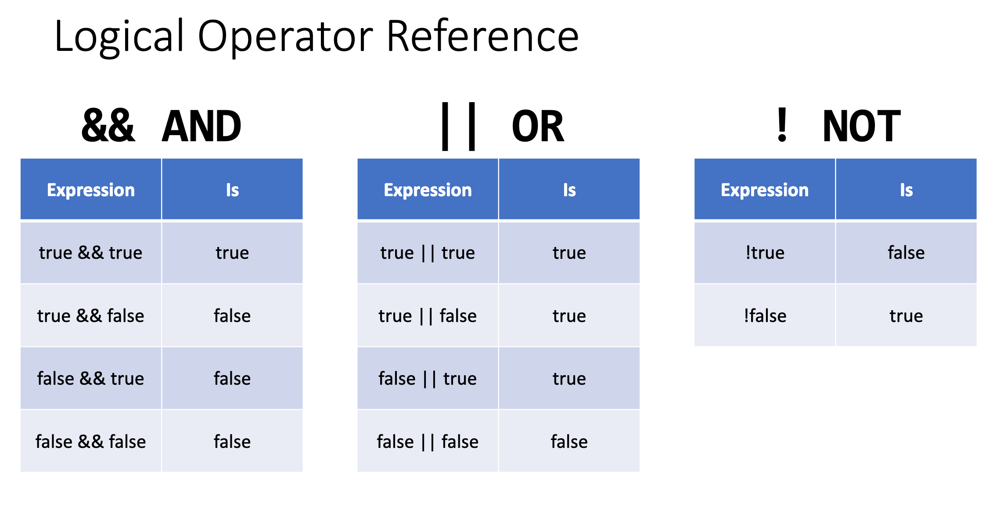
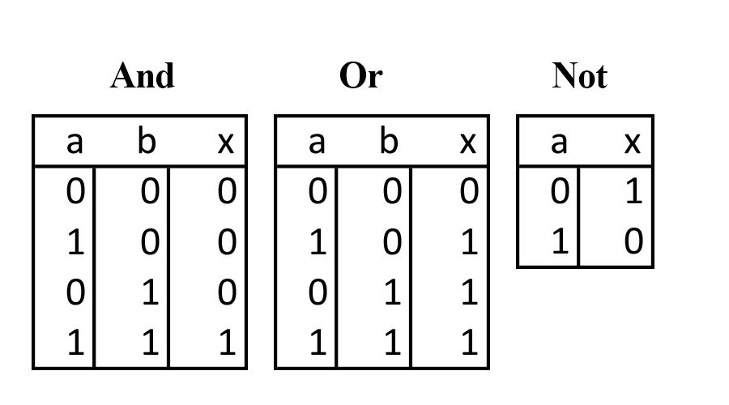
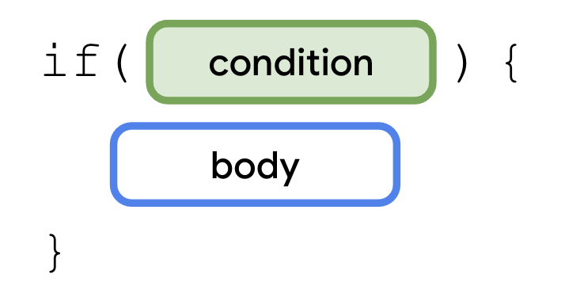
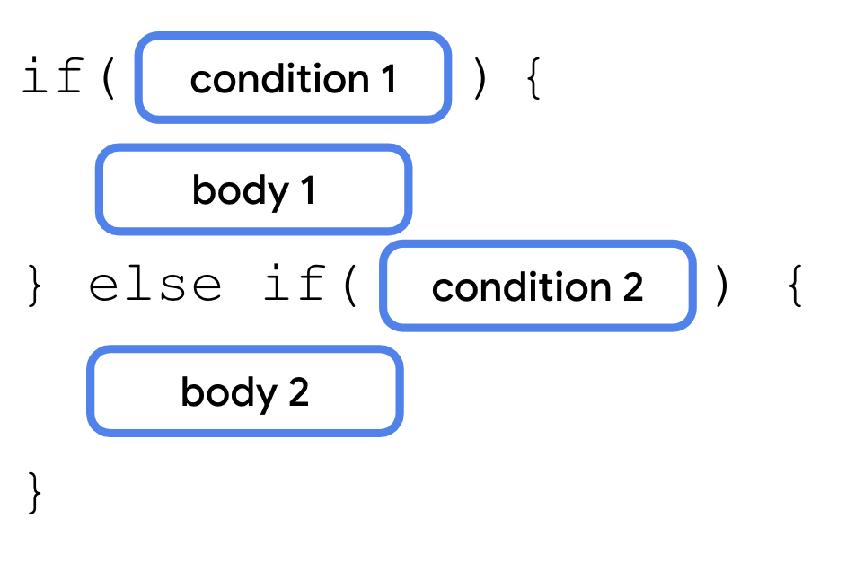
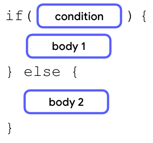
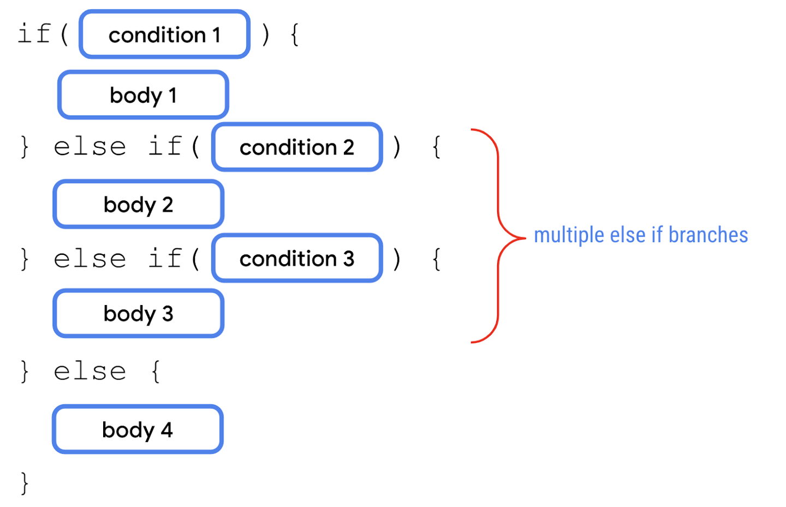

# Gün 3 - Kotlində Control Flow(Şərt və dövrlər)


> Təsəvvür edin ki sizə bir n tam ədədi(məsələn 16) verilir, və istənir ki ədədi gözdən keçirib, aşağdakı şərtlərə müvafiq yazıları ekrana çıxarasınız:
- Həm 3-ə, həm 5-ə bölünürsə - > FizzBuzz 
- 3-ə bölünənürsə - > Fizz 
- 5-ə bölünənürsə - > Buzz 
- Nə 3-ə, nə də 5-ə, heç birinə bölünmürsə - > Ədədin özü

Bu proqramlaşdırmada çox məhşur [FizzBuzz](https://leetcode.com/problems/fizz-buzz/description/) məsələsinin sadələşdirilmiş halıdır. 

Başlayaq addım-addım həll etməyə...

**Məntiq yürüdək**
**"X ədədi Y ədədinə bölünür"** nə deməkdir? O deməkdir ki, **"X-i Y-ə böldükdə qalıq 0-a bərabərdir"**. **Onda biz əvvəlcə Kotlində qalığı hesablamağı öyrənməliyik**

### 1. **Kotlində qalıq necə tapılır?**

Kotlində [çoxsaylı operatorlar](https://kotlinlang.org/docs/keyword-reference.html#operators-and-special-symbols) arasında qalığı tapmaq üçün `%` operatorundan istifadə olunur. Əlavə olaraq 
`mod` və `rem` adlanan funksiyalar da var. Bu üç yol arasında [bəzi nüanslarda](https://medium.com/@alexvanyo/kotlin-functions-rem-and-mod-fa2e865304c3) fərqlər var. Biz sadəlik olsun deyə `%` istifadə edək.

Nümunə: 
```
val remainder = 5%3 // remainder : 2
val remainder2 = 10%5 // remainder2 : 0
```
**Okay, qalığı tapmağı öyrəndik.** 

**Məsələnin şərtinə fikir verdinizsə, 3-ə bölünsə filan söz, 5-ə bölünsə filan söz... deyə  şərt əsaslı davranış(conditional) var**

> Qərar vermə proqramlaşdırmada əsas anlayışlardan biridir. Proqramın müəyyən bir vəziyyətdə necə davranması barədə təlimatlar yazırsınız ki, vəziyyət yarandıqda ona uyğun hərəkət edə və ya reaksiya verə bilsin.

Kotlində də **conditionallar(şərt strukturları)** var : **if-else** və **when**
Amma onlardan əvvəl **boolean expressionlar** haqda danışmalıyıq.

### Qısaca boolean expressionlar

> Expressionlar(İfadələr) dəyərləri, dəyişənləri və operatorları kombinasiya edir və yekun bir dəyər return edir(qaytarır)

Məsələn bu bir ifadədir : `(5 + var1) % 2`

> Boolean dəyər return edən expressionlar da, boolean expression adlanır

Ən sadə nümunələrini **müqayisə və bərabərlik(comparison and equality)** operatorları istifadə edərək göstərmək olar:
Müqayisə və bərabərlik operatorları : 
- `>`, `<` 
- `<=` *("kiçik bərabərdir")* , `>=` *("böyük bərabərdir") *
- `==` *("bərabərdir")* , `!=` *("bərabər deyil")* 

Nümunə:

```
val remainder = 8%3 // remainder:2
println(remainder==0) // false : çünki ,"remainder 0-a bərabərdir" mülahizəsi doğru deyil.
println(remainder!=0) // true : çünki, "remainder 0-dan fərqlidir" mühahizəsi doğrudur.
```

Həmçinin  daha mürəkkəb boolean expressionlar üçün məntiqi vurma(AND), cəm(OR), və inkar(NOT) əməlləri var.
Bu cədvəllərə baxaraq  rahatlıqla onları anlaya bilərsiniz.(true 1, false 0-la işarə olunur.)





**Bu məntiqi əməllərin Kotlində tətbiq üsulları:**
- AND - `&&` operatoru, `and` funksiyası
- OR -  `||` operatoru, `or` funksiyası
- NOT - `!` operatoru, `not` funksiyası

Məntiqi vurma və cəmin üsulları arasında [kiçik davranış fərqləri](https://www.linkedin.com/feed/update/urn:li:activity:7159155085602668544/) olsa da, nəticədə eyni işi görürlər. 

Kod nümunələri:
```
// Məntiqi vurma
println((15%3==0) && (15%5==0)) // (true) x (true) = true
println((15%3==0) and (12%5==0)) // (true) x (false) = false

// Məntiqi cəm
println((12%3==0) || (11%3==0)) // (true) + (false) = true
println((12%5==0) || (11%3==0)) // (false) + (false) = false

// Məntiqi inkar
println(!(20/4==5)) //inkar (true) = false
println((2+2==5).not()) //inkar (false) = true

```

**Boolean expressionları anladıqsa, qaldığımız yerdən davam edək...**

### 2. Kotlində şərt əsaslı davranışların tətbiqi necədir?
Ən fundamental strukturdan, **if-else** istifadə edək, növbəti yazılarda **when**-ə də toxunarıq:


**If, else if, else açar sözlərinin izahı:**
1. if - şərtli davranışı təmin etmək üçün məcburi və ilkin açar sözdür.



İki anlayışı oturdaq: **condition** və **body**.

> Condition(şərt) - çox zaman booelan expressionla ifadə edilir, özündən sonraki kod blokunun, body-nin icra olunub-olunmayacağını müəyyənləşdirir.

> Body - əmrlər silsiləsi, kod parçasıdır

**condition true olarsa, müvafiq body icra olunur**

*Real həyat nümunəsi : Yaşıl işıq yanırsa hərəkət et!*

2. else if - Bir çox halda məsələlərin həlli tək bir amildən asılı olmur, bir çox qərar nöqtəsi, ardıcıl yoxlanmalı conditionlar tələb edir.(Necə ki bizim məsələmiz).



**condition1 true olsa body1 icra olunur və növbəti conditionlara heç baxılmır, onlar heç yoxlanmır. condition1 false olsa, condition2 yoxlanır. O true olsa body2 icra olunur növbəti conditionlar heç yoxlanmır**

Bu səbəbdən else if istifadə edərkən condition və body-ləri vaciblik dərəcəsinə görə düzmək lazımdır.


else-if istifadəsində limit yoxdur, istədiyiniz qədər condition və body yazın. Amma çox uzun if-else if zəncirləri kodun anlaşırlığını azalda bilər, diqqətli olmaq lazımdır. 

*Real həyat nümunəsi : Yaşıl yanırsa hərəkət et, sarı yanırsa hazırlaş, qırmızı yanırsa dur!*

3. else - Biz istəyə bilərik ki, heç bir condition true olmasa, sonuncu ehtimalı, bir növ "axırıncı yolu" özümüz müəyyənləşdirək. Bu tez-tez məsələlərin həllində tələb olunur. Bu halda else istifadə olunur. 



**condition true olsa, body1 icra olunur, false olarsa body2 icra olunur.**

*Real həyat nümunəsi : Cola varsa onu al, yoxdursa Pepsi, LAP O DA YOXDURSA Fanta al (day neyniyək)*

Else bir növ bizim "hava yastığımızdır", proqramın icrasında xətaları minimuma endirmək üçün idealdır. 

### Məsələnin həlli:
Artıq məsələmizi həll etmək üçün hər şeyi bilirik. O halda getdik!
Məsələmizdə həm çoxlu qərar nöqtəsi, həm də "axırıncı yol" var. Bu səbəbdən if, else if, else üçü də bizə lazımdır.
Şərtlərimizi vaciblik dərəcəsinə əsasən yuxarıdan aşağı yazacayıq.
Strukturumuz buna bənzəyəcək:



### Kod:
```
fun main(){
// test üçün istədiyiniz ədədi verin
val n = 15 

//şərtləri qurmağa başlayaq
if(n%3==0 && n%5==0) {
    println("FizzBuzz")
}
/*
Məsələn condition1 true olsa, body1 işə düşsə, kodun icrası sonlanacaq, çünki şərt strukturlarından sonra heç bir sətir yoxdur. 
*/

//Şərtlərə davam edək
else if(n%3==0){
    println("Fizz")
}

else if(n%5==0){
    println("Buzz")
}
//Heç biri ödənməsə else bloku işə düşür, və kod icrası sonlanır
else{
    println(n)
}
}
```


    


