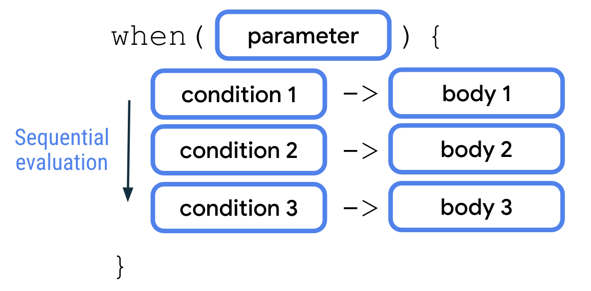

# Gün 4 : Kotlin Control Flow Part 2

>Bizə bir tələbənin müəyyən fənn üzrə yekun balı verilir və bizdən istənir ki, 
onu aşağıdakı meyarlara müvafiq olaraq sözlə ifadə edək və ekrana çıxaraq:
- 51-60 intervalı -> Qənaətbəxş
- 61-70 intervalı -> Kafi
- 71-80 intervalı -> Yaxşı
- 71-80 intervalı -> Yaxşı
- 81-90 intervalı -> Çox Yaxşı
- 91-100 intervalı -> Əla

**Soruşa bilərsiniz ki, "bunun [keçən yazıdakı](https://medium.com/@teymurmemmedov314/gün-3-kotlində-control-flow-part-1-ca5c1bf57f02) məsələdən fərqi nədir?"**

*Əslində texniki olaraq haqlısınız, if-else statementləri və boolean expressionlarla asanlıqla bu məsələni həll edə bilərsiniz.*

```
fun main(){
    val finalPoint = 34

    if (finalPoint >= 0 && finalPoint <= 50) {
        println("Qeyri kafi")
    } 
    else if (finalPoint >= 51 && finalPoint <= 60) {
        println("Qənaətbəxş")
    } 
    else if (finalPoint >= 61 && finalPoint <= 70) {
        println("Kafi")
    } 
    else if (finalPoint >= 71 && finalPoint <= 80) {
        println("Yaxşı")
    } 
    else if (finalPoint >= 81 && finalPoint <= 90) {
        println("Çox Yaxşı")
    } 
    else if (finalPoint >= 91 && finalPoint <= 100) {
        println("Əla")
    }
    else{
        println("Xətalı giriş!")
    }
}
```

**Amma bir baxın, bu kod necə də çirkin və uzundur!**

*Axı biz demişdik ki Kotlin müasir dildir, müasir dillərin də əsas xüsusiyyəti aydın, minimal kodlama tələb edən sintakslarıdır. Bu səbəbdən bu kodu necə ideal hala gətirəcəyimizi addım-addım araşdıraq.*

### Condition-ları necə daha yaxşı yaza bilərik?
Kodumuzdaki **condition**-lar verilən ədədin müəyyən intervala daxil olub-olmadığını yoxlamaqdan ibarətdir. 
Kodda bunu bəsit riyazi yanaşma ilə həll etmişik.
*Əgər finalPoint 81-dən böyük bərabərdirsə və 90-dan kiçik bərabərdirsə, deməli o 81-90 intervalındadır.*

Tətbiqi : `finalPoint >= 81 && finalPoint <= 90`

**Amma razılaşarsınız ki, bu üsul oxunaqlı deyil, üstəlik çox uzundur.**

Daha yaxşısını yazmaq üçün iki şeyi bilmək lazımdır : [**range**](https://www.baeldung.com/kotlin/ranges) anlayışı və **in** operatoru 
#### 1. Range
> Range start, end və step-i (neçə-neçə artacaq/azalacaq) müəyyən edilmiş dəyərlər ardıcıllığıdır. 

- **Kotlin-də range yaratmağın ən ümumi yolu `..` operatorundan istifadə etməkdir.** 
Məsələn, 1..4 => 1, 2, 3, 4-ə bərabərdir.

- **Son dəyərin daxil olmadığı range elan etmək üçün `..<` operatorundan istifadə edirik.** 
Məsələn, 1..<4 => 1, 2, 3-ə bərabərdir.

- **Azalan aralıq elan etmək üçün `downTo` istifadə edirik.** 
Məsələn, 4 downTo 1 => 4, 3, 2, 1-ə bərabərdir.

- **Step-i 1-dən fərqli olan range-lər `step` istifadə edirik** 
Məsələn, 1..5 step 2 =>  1, 3, 5-ə bərabərdir.

#### 2. [in](https://www.baeldung.com/kotlin/in-notin-operators) operatoru

> **in** - expressionlarda dəyərin range-ə, kolleksiyaya və s. aid olub-olmadığını yoxlamaq üçün istifadə olunur, vəziyyətə uyğun olaraq true yaxud false, boolean dəyər qaytarır. 

*Bu bildiklərimiz əsasında belə bir çevirməyə gedə bilərik :* `finalPoint >= 81 && finalPoint <= 90` => `finalPoint in 81..90`

**Bu bilik əsasında **condition**-ları yenidən yazaq.**

**Kiçik bir qeyd :** *Xüsusi olaraq, əgər `if-else-else if` strukturlarında body cəmi 1 statementdən(əmrdən) ibarətdirsə, `{` , `}` atıla bilər. Ardıyca da estetik olsun deyə  println()-ləri çəkək **conditionalların** önünə*

```
val resultWithNumber = 34

if (resultWithNumber in 0..50) println("Qeyri kafi")
else if (resultWithNumber in 51..60) println("Qənaətbəxş")
else if (resultWithNumber in 61..70) println("Kafi")
else if (resultWithNumber in 71..80) println("Yaxşı")
else if (resultWithNumber in 81..90) println("Çox Yaxşı")
else if (resultWithNumber in 91..100) println("Əla")
else println("Xətalı giriş!")
```

*Kodumuz nisbətən yaxşılaşdı elə deyil mi? Amma biz onu optimallaşdırmağa davam edəcəyik.*

### If-else strukturunu daha effektiv necə istifadə etmək olar?
Biz indiyə qədər if-else strukturunu **statement kimi** istifadə etmişik , yəni şərtlərdən(condition) asılı olaraq müxtəlif kod bloklarının(body) icrasını təmin etmişik. Amma elə hallar olur ki, body-lər bir-birinə bənzər olur, eyni əməliyyatlar təkrar-təkrar yazırıq. Bu da kodu uzadır, eynilə bizim nümunəmizdə kimi(println()-i dəfələrlə yazmışıq). Yaxşı olmazdı mı ki, **sadəcə dəyəri əldə edək, dəyişənə mənimsədək, və onu cəmi bir println() statementi ilə çap edək?**

**Bunun üçün Kotlin bizə if-else expressionları təmin edir.**

*İf-else strukturunun statement və expression kimi istifadələri bənzəyir, lakin fərqləri var.*
1. Qaytarılacaq dəyər body-nin sonunda yazılmalıdır.
2. Expression dəyişənə mənimsədiləcəksə, expressiona mütləq else də daxil olmalıdır.

Kiçik nümunə:
```
val myNumber = if(condition){
    val a = 2+2
    a //qaytarilan deyer
}
else{
    val b = 3+3
    b // qaytarilan deyer
}
println(myNumber)
```

*Bu biliklər əsasında kodumuzu yenidən yazaq.*

```
val resultWithNumber = 34
val resultWithWord = if (resultWithNumber in 0..50) "Qeyri kafi"
                     else if (resultWithNumber in 51..60) "Qənaətbəxş"
                     else if (resultWithNumber in 61..70) "Kafi"
                     else if (resultWithNumber in 71..80) "Yaxşı"
                     else if (resultWithNumber in 81..90) "Çox Yaxşı"
                     else if (resultWithNumber in 91..100) "Əla"
                     else "Xətalı giriş!"
println(resultWithWord)
/*Condition-lar sıra ilə yoxlanacaaq, elə birincisi true olduğu üçün
resultWithWord-ə "Qeyri-kafi" mənimsənəcək və ekrana o çıxacaq*/
```

**Budur, biz artıq if-else strukturunun zirvəsinə çatdıq, yazıla biləcək ən optimal forma budur.**

*Bu tip if-else expressionları yetəri qədər səliqəli və oxunaqlıdır, xüsusilə az conditionlu hallarda*

Məsələn: 
```
// Num1 və num2 verilir
val num1 = 10
val num2 = 15
//Sadəcə bir sətirdə böyük ədədi tapırıq
val bigNum = if(a>b) a else b
```

**Lakin bizim məsələmiz kimi 2-dən çox şərt varsa, daha mükəmməl struktura ehtiyacımız var.**

### Çoxşaxəli, çoxşərtli hallar üçün daha yaxşı seçim var mı?
**Əlbəttə ki var!**

> Kotlin-də çoxşərtli hallarda if/else əvəzinə when istifadə edilir.

**when-in sadə strukturu belədir:**



When parametr, tək bir dəyər götürür. Daha sonra parametr ardıcıl olaraq condition-ların hər biri dəyər baxımından müqayisə olunur. Bu səbəbdən when-in **sadə tətbiqində** parametr və conditionlar eyni data tipdən olmalıdır. Əks halda `Incompatible types` erroru alacayıq. 

Nümunə:
```
//Burda da body tək statementdən ibarətdirsə, `{`, `}` atılır
val number = 3
when(number){
    1 -> println("One")
    2 -> println("Two)
    3-> println("Three")
}
/* number-ın dəyəri tək tək conditionlarla yoxlanacaq, 
və sonuncu uyğun gəldiyi üçün ekrana 3 çıxacaq*/
```

**Məncə təxmin edirsiniz ki, burda da expression istifadəsi ilə kodu daha da optimallaşdıra bilərik.** 

*When expressionların, if-else expressionlardan cüzi fərqi var(2-ci bənd), amma əsasən eynidir:*

1. Qaytarılacaq dəyər body-nin sonunda yazılmalıdır.
2. Expression dəyişənə mənimsədiləcəksə, expressiona mütləq else də daxil olmalıdır.(İstisnalar var.)

```
val number = 3
val numberWithWord = when(number){
    1 -> "One"
    2 -> "Two
    3-> "Three"
    // Heç bir conditionla uyğunlaşmasa, else blokunun bodysindəki dəyər qaytarılacaq
    else -> "Invalid Number"
}
println(numberWithWord)
/*number-ın dəyəri tək tək conditionlarla yoxlancaq, 
sonuncu uyğun gəldiyi "Three" dəyəri numberWithWord-ə mənimsənəcək, ekrana 3 çıxacaq*/
```

**Bu biliklər işığında belə bir şey yaza bilərik**

```
 val resultWithNumber = 89
    val resultWithWord = when(true){
          (resultWithNumber in 0..50)-> "Qeyri kafi"
          (resultWithNumber in 51..60) ->"Qənaətbəxş"
          (resultWithNumber in 61..70) ->"Kafi"
          (resultWithNumber in 71..80) ->"Yaxşı"
          (resultWithNumber in 71..80) ->"Yaxşı"
          (resultWithNumber in 81..90) ->"Çox Yaxşı"
          (resultWithNumber in 91..100)->"Əla"
          else-> "Xətalı giriş!"

    }
    println(resultWithWord)
```
Amma məsələ burasındadır ki, biz "parametr və condition-ların eyni data tipdə olsun" məcburiyyətindən ən azından zahiri olaraq xilas ola bilərik və kodumuzu daha mənalı və qısa edə bilərik. Bunun üçün Kotlin bizə when-in **kompleks tətbiqlərini** təklif edir,

Bu kompleks istifadələri `,`, `in`, `!in` və `is` operatorları vasitəsilə həyata keçiririk.

- `,` bir body bir neçə condition üçün ödənirsə, istifadə oluna bilər.
Məsələn:
```
// x 0-da olsa, 1-də olsa eyni body işə düşəcək.
when (x) {
    0, 1 -> print("x == 0 or x == 1")
    else -> print("otherwise")
}
```

- `in`, `!in` - when və bu operatorların kombinasiyası parametrimizin müəyyən range-də və ya collectionda olub-olmadığını yoxlamağı asanlaşdırır.
Məsələn:
```
when (x) {
    in 1..10 -> print("x is in the range")
    in validNumbers -> print("x is valid")
    !in 10..20 -> print("x is outside the range")
    else -> print("none of the above")
}
```

*Bütün bu biliklər əsasında, kodumuzu son dəfə yenidən yazaq*

```
val resultWithNumber = 91
val resultWithWord = when(resultWithNumber)
{
     in 0..50 -> "Qeyri kafi"
     in 51..60 ->"Qənaətbəxş"
     in 61..70 ->"Kafi"
     in 71..80 ->"Yaxşı"
     in 71..80 ->"Yaxşı"
     in 81..90 ->"Çox Yaxşı"
     in 91..100->"Əla"
     else -> "Xətalı giriş"
}
println(resultWithWord)
```

Budur, artıq kodumuz ən mükəmməl halına çatdı. Bura qədər oxudunuzsa, təşəkkür edirəm. Növbəti yazıda da Control Flow-a davam edəcəyik. Hələlik isə sağolun!


