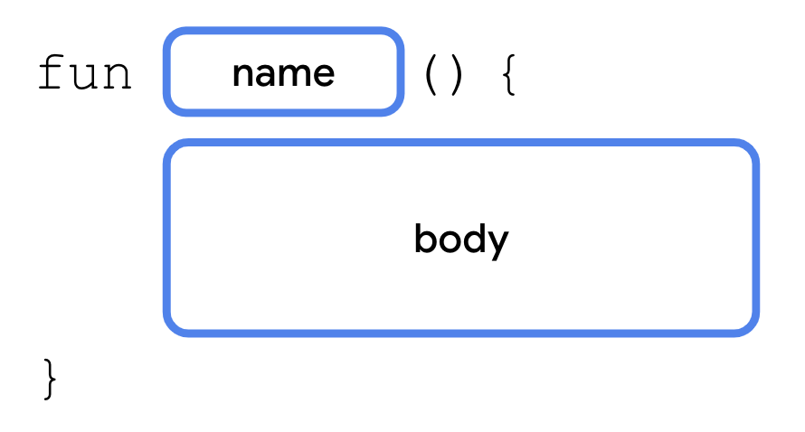

# Gün 6 : Kotlində Funksiyalar Part 1


### Bu yazıdan nə öyrənəcəksiniz?
- Functions and their usage
- Explicit return types
- Unit-returning functions
- Parameters, Default arguments, Named arguments
- Single-expression functions

### Günün problemi:
> Integer tipində array verilir və aşağıdakıları hesablamaq tələb olunur:
- array daxilindəki ədədlərin cəmini hesablamaq
- array daxilində ən kiçik ədədi tapmaq
- array daxilində ən böyük ədədi tapmaq

*Bildiklərimiz əsasında bu məsələni həll edək:*

```
fun main() {
    val nums1:Array<Int> = arrayOf(1,3,5,7,9,11,13,15)

    var nums1Sum = 0
    var nums1Min = nums1[0]
    var nums1Max = nums1[0]
    //Cemi hesablamaq 
    for(i in nums1)
        nums1Sum+=i

    //Minimumu tapmaq - İterasiyada mövcud minimumdan kiçik eded tapılsa, onun deyeri yeni minimum hesab edilir.
    for(i in nums1)
        if(i<nums1Min) nums1Min = i

    //Maximumu tapmaq - İterasiyada mövcud maximumdan böyük eded tapılsa, onun deyeri yeni maximum hesab edilir.
    for(i in nums1)  
        if(i>nums1Max) nums1Max = i

    //Sum,Maximum,Minimum    
    println("$nums1Sum : $nums1Min : $nums1Max")
}
```

**Yaxşı bəs eyni əməli birdən çox və fərqli sayda elementli array-lər üçün etmək lazım gəlsə?**

*İndiki halda ən yaxşı edə biləcəyimiz şey kodu kopyalayıb, variable adlarını editor-un nemətlərindən faydalanaraq 
sürətlə dəyişmək və müxtəlif əməlləri bir `for` altına toplayıb kodu bir qədər qısaltmaqdır.*

```
fun main(args: Array<String>) {
    val nums1:Array<Int> = arrayOf(1,3,5,7,9,11,13,15)
    val nums2:Array<Int> = arrayOf(2,4,6,8,10,12)

    var nums1Sum = 0
    var nums1Min = nums1[0]
    var nums1Max = nums1[0]
    for(i in nums1){
        nums1Sum+=i
        if(i<nums1Min) nums1Min = i
        else if(i>nums1Max) nums1Max = i
    }

    var nums2Sum = 0
    var nums2Min = nums2[0]
    var nums2Max = nums2[0]
    for(i in nums2){
        nums2Sum+=i
        if(i<nums2Min) nums2Min = i
        else if(i>nums2Max) nums2Max = i
    }

    println("$nums1Sum : $nums1Min : $nums1Max")
    println("$nums2Sum : $nums2Min : $nums2Max")
}
```

*Problemi "həll etdik", amma bu "həllin" yan təsirləri də var:*

1. **Kod oxunaqlığı məhv oldu**
2. **Üçüncü bir array gəlsə, başımız bəladadır**
3. **Arraylər üzərində yeni bir əməliyyat sifarişi gəlsə, başımız bəladadır.**

**Bütün proqramlaşdırma dillərində, eləcə də Kotlində bu problemi həll etmək üçün Funksiyalar mövcuddur.**

### Funksiyalar

>Funksiyalar hər şeyi main()-a daxil etməkdənsə, kodunuzu təkrar istifadə edilə bilən(reusable) parçalara ayırmağa imkan verir. 

**Funksiyanın gətirdiyi üstünlüklər:**
- Bir dəfədən çox istifadə etməli olduğunuz kodu kopyalayıb yapışdırmaq əvəzinə, kodları funksiyalarda toplayıb, lazım olan yerdə  funksiyanı çağıra bilərsiniz. 
- Funksiyaların yalnız bir xüsusi tapşırığı yerinə yetirir, bu da digər proqramçılara, eləcə də gələcəkdə özümüzçün kod parçasının tam olaraq nə etdiyini anlamağa kömək edir.
- Əgər zamanla kod parçalarımızda optimallaşdırma, update olsa, sadəcə funksiyanı dəyişərək bütün kod boyu updatelərin tətbiqinə nail ola bilərik

**Məcazi izah:**
Təsəvvür edin ki, aşpazsınız. Müxtəlif yeməklər hazırlamaq üçün bir dəstə reseptiniz  var. Ancaq tərəvəzləri təmizləmək yaxud mətbəxi yemək bişirmək üçün hazırlamaq eyni addımları təkrar-təkrar yazmalı olursunuz. Funksiyalar sizin xüsusi resept kolleksiyalarınız kimidir! Eyni addımları hər dəfə yenidən yazmaq əvəzinə, onları "ChopLikeNinja" və ya "BoilItUp" kimi cəlbedici adla funksiyaya qruplaşdıra bilərsiniz. 


### Ən sadə halda funksiya necə elan olunur(declare/define) və çağrılır(call)?
Kotlində funksiyalar `fun` açar sözü ilə declare edilməyə başlayır.



- **name** - Funksiyaya ad təyin edirik, kodun davamında bu funksiyaya bu adla istinad edəcəyik, call edəcəyik vs.
- **body** - Funksiya çağırıldıqda işə düşəcək təlimatlardır.

**C#,Java kimi dillərdən fərqli olaraq, Kotlində funksiya elan etmək üçün class yaratmaq məcburi deyil.**

```
//calculateSum funksiyasini declare edirik
fun calculateSum(){
    val a = 5
    val b = 12
    val sum = a+b
    println(sum) 
}

fun main(){
    //ehtiyacimiz olduqda çağırırıq
    calculateSum()
}
```

### Unit-returning functions

> Unit-returning funksiyalar çağırıldıqda sadəcə body-sini icra edir, istifadəyə yararlı heç bir data return etmir. 
Unit digər dillərdə `void`-in Kotlindəki qarşılığıdır. Digər dillərdə bu tip funksiyalarda `void` açar sözü məcburidir, amma Kotlində funksiyanın Unit tip qaytardığını açıqca(explicitly) yazmaq məcburi deyil

*Az-əvvəl yaratdığımız funksiya Unit-returning idi.*

```
// Funksiya texniki olaraq Unit tipi return edir, amma bunu kodda qeyd etmeye ehtiyac yoxdur.
fun someFun(){
    println("salam")
}

fun main() {
val some = someFun()
println(some::class) //kotlin.Unit type
}
```

### Funksiyaların dəyər qaytarması
Əksər hallarda Unit-returning funksiyalar bizə bəs etmir.

**Kotlin funksiyaları həm də dəyər qaytara bilir(return value), hansı ki o dəyəri dəyişəndə saxlaya, başqa funksiyalara dəyər kimi ötürə, qısası kodumuzun fərqli nöqtələrində istifadə edə bilərik**

*Bunun üçün function declare şablonuna bir qədər dəyişiklik edirik:*


**Əgər funksiyamız istifadəyə yararlı bir dəyər qaytarsın istəyiriksə, bu iki elementi yazmaq məcburidir:**

- **return type** - Funksiyanın  qaytarmasını istədiyimiz dəyərin data tipi (Int, String və s.) 

- **return statement** - return açar sözü +  sonra qaytarmaq istədiyimiz dəyər.
    - expression formasında : `return if(a>b) 2 else 4`, `return a+b`
    - variable formasında : `return sum`, `return name`
    - bir başa : `return "Hello"`, `return true`

*Bu biliklər işığında calculateSum funksiyamızı yenidən yazaq.*

```
fun calculateSum():Int{
    val a = 5
    val b = 12
    return a+b
}

fun main(){
    val sum = calculateSum()
    println(sum) 

    //calculateSum()-ın deyerini println()-e bir başa ötüre(pass) ede bilerik
    println(calculateSum()) 
}
```

### Unit-returning və dəyər qaytaran funksiyaların fərqi

Təsəvvür edin ki, bir roboto bir iş üçün proqramlaşdırırsınız.
- Əgər robota desək ki, X nöqtəsində Y işini gör və başqa işlərinə davam et, işin nəticəsini yadında saxlama, lazım deyil, bu olur - **unit-returning function**
- Yox əgər deyiriksə ki, "X nöqtəsində Y işini gör, işinin nəticəsini bu qaba yerləşdir, yaxud digər bir işində istifadə et ondan və s" bu artıq olur : **dəyər qaytaran funksiya**

### Parametrli funksiyalar

Funksiyalar daha effektiv və dinamik olsun deyə onlara xaricdən dəyərlər ötürməli oluruq. Bu dəyərlər `parameters` adlanan hissədə elan olunur.

**Bunu belə izah edə bilərəm:**
*Kofe maşınları həmişə içində kofe və su ilə satıla bilməz doğrudur? Onlar sadəcə elə boşluqlara/bölmələr' sahibdirlər ki, siz ora lazım olduqda kofe və su doldurasınız. Kofe və su daxil edilən bölmələr kofe maşınının "parametrləridir".*


- parameters - `ad: tip` notasiyası ilə elan edilir. Parametrlər vergüllə ayrılır.
```
fun calculateSum(a:Int, b:Int):Int{
    return a+b
}

fun main(){
    println(calculateSum(5,10))
}
```

**Parametrli funksiyalarla bağlı qaydalar:**
1. Parametrli funksiya çağrıldıqda mütləq arqumentlər daxil edilməlidir. Yəni funksiyanın a və b deyə iki integer parametri varsa, `calculateSum(1,2)` `calculateSum(5,9)` şəklində çağırılmalıdır. Əks halda proqram xəta verəcək.
**İstisna: default arguments** - bu parametrlərin default dəyəri funksiya elan edilərkən verilir və proqramçı **istəsə** o parametrə dəyər vermədən də funksiyanı çağıra bilər. Əgər bir parametr 95% eyni dəyəri alırsa, yaxud dəyər verilməsi o qədər də vacib deyilsə, default argument yanaşması bizə kömək edir. 

2. Arqumentlər parametrlərin elan olunduğu sıraya uyğun daxil edilməlidir. Yəni compiler gözləyir və düşünür ki `divideNumbers(12.0, 6.0)` çağrılışında 12.0 -> a, 6.0 -> b parametrinə uyğundur.
**İstisna : named arguments** - funksiyanı çağırdıqda, arqumenti parametr adı ilə birgə versək, həmin arqument named argument adlanır. Default parametrləri `skip` etmək arqument sıralamasında xaosa səbəb olduqda, named argument bizi xilas edir.

**Default argumentləri `parameters`-in sonuna yığmaq məsləhətdir ki onları rahat `skip` edə bilək**
```
fun divideNumbers(a:Double,b:Double):Double{
    return a/b
}

fun greeting(name:String = "Stranger"):String{
    return "Hello $name"
}

fun main(){
    //12.0 ve 3.0 deyerleri arqument adlanır
    println(divideNumbers(12.0, 3.0)) //4.0

 
    // Gördüyünüz kimi sıranı poza bilirik named arguments istifadə etdikdə
    println(divideNumbers(b=3.0, a =12.0)) // 4.0 

    // name parametrine default olaraq Stranger deyeri vermişik
    // Boş qoya bilərik
    println(greeting()) //Hello Stranger

    //Tebii ki, öz istediyimiz arqumenti de vere bilerik
    println(greeting("Teymur")) //Hello Teymur
}
```

### Single-expression functions

Əgər `function body` tək bir expressiondan ibarətdirsə, funksiya elanında aşağıdakılar ixtisara düşə bilər:
- return type
- return statement
- curly braces

```
//Funksiyalari bu şekilde daha qısa şekilde elan edirik.
//Lazım olanda adi qaydada çağıra bilerik.
fun calculateSum(a:Int,b:Int) = a+b
fun divideNumber(a:Double, b:Double) = a/b
fun greeting(name:String="Stranger") = "Hello $name"
fun someFun() = println("something")
```

### Günün probleminə yekun həll

```
fun findSum(nums:Array<Int>):Int {
    var sum = 0 
    for(i in nums) 
        sum+=i
    return sum
}

fun findMin(nums:Array<Int>):Int{
    var min = nums[0]
    for(i in nums)
        if(i<min) min = i
    return min;
}

fun findMax(nums:Array<Int>):Int{
    var max = nums[0]
    for(i in nums)
        if(i>max) max = i
    return max;
}


fun main(args: Array<String>) {
    val nums1:Array<Int> = arrayOf(1,3,5,7,9,11,13,15)
    val nums2:Array<Int> = arrayOf(2,4,6,8,10,12)
    //Sum,Maximum,Minimum    
    println("${findSum(nums1)} : ${findMin(nums1)} : ${findMax(nums1)}")
    println("${findSum(nums2)} : ${findMin(nums2)} : ${findMax(nums2)}")
}
```

Artıq neçə dənə array gəlir-gəlsin(lap X sayda), sadəcə bir sətir artıraraq problemi həll edə bilərik.

`println("${findSum(numsX)} : ${findMin(numsX)} : ${findMax(numsX)}")`


Beləliklə bu günün də problemini həll etdik. Bura qədər oxudunuzsa, təşəkkür edirəm. Növbəti yazıda **Kotlində OOP** mövzusuna giriş edəcəyik. Hələlik isə sağolun!